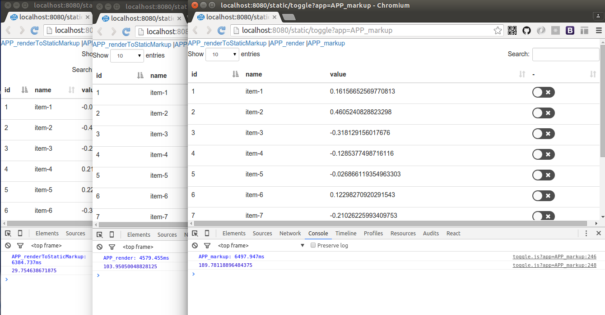

# react-datables-example
Example for Datatables usage with React and Webpack

> This example will mainly focus on how to use Datatables and its extensions in React project instead of diving into the [fabulous API](http://www.datatables.net/reference/api/).

**How to run this example**

```sh
npm install && npm start
```

Open your browser and navigate to [http://localhost:8080/static/entry](http://localhost:8080/static/entry)

### How to import Datatables ?

```js
import $ from 'jquery';
import 'datatables.net';
```

After being imported, you can initialize a table DOM element normally

`$(elem).dataTable(options)` or `$(elem).DataTable(options)`

### Is it possible to use DataTable object directly ?

No, because it is deeply coupled with jQuery, it requires jQuery context to intialize the table.

In fact, the DataTable object is imported by default.

```js
import $ from 'jquery';
import DataTable from 'datatables.net';
console.log(DataTable === $.fn.dataTable); // true
```

### How to import Bootstrap styling ?

```js
import 'bootstrap/dist/css/bootstrap.css';
import 'datatables.net-bs/js/dataTables.bootstrap';
import 'datatables.net-bs/css/dataTables.bootstrap.css';
```
Then, make sure you configure the `css-loader` and `style-loader` right in `webpack.config.js` file.

### How to load the i18n/fonts file asynchronously ?

Extend the dataTable.defaults object

```js
$.extend(true, $.fn.dataTable.defaults, {
  language: {
    url: require('../lib/zh_cn.json')
  }
});
```

Loading i18n files is just like loading icon font files.

```js
{
  test   : /\.(json|ttf|eot|svg|woff(2)?)(\?[a-z0-9]+)?$/,
  loader : 'file-loader',
  query:{
    name:'[name]-[md5:hash:8].[ext]'
  }
}
```

### How to load extensions ?

Check the extensions list, https://www.npmjs.com/~datatables

To import an extension, normaly it would require two steps as following:

```js
import 'datatables.net-fixedheader';
import 'datatables.net-fixedheader-bs/css/fixedHeader.bootstrap.css';
```

1\. Load the extension script, normaly the entry file is defined in package.json `main` property ;

2\. Load the style for specific front-end framework. For example, `bs` means `Bootstrap`.

### How to use string templates

[ES6 template](https://github.com/esnext/es6-templates) is a good choice

Data:

```js
[
  {
    name:'1',
    foo:{
      bar:1
    }
  }
  ...
]
```

Columns:

```js
[
  {
    data:'foo',
    title:'foo.bar',
    render:foo=>`<em>${foo.bar}</em>`
  }
  ...
}
```

### How to use React components in cell rendering

Let's assume we need to use the `react-toggle` component in our table.

We have three ways to use it:

**Implement render function and use React DOM server's renderToStaticMarkup method**

```js
{
  columns:[{
    ...
    render:elem=>renderToStaticMarkup(<Toggle/>)
  }]
  ...
}
```

**Implement datatable createdCell function and create multiple React roots**

```js
{
  columns:[{
    ...
    createdCell:(td,val)=>render(<Toggle/>,td)
  }]
  ...
}
```

**Prepare the HTML markup first and then initialize the Datatable**
```html
<tbody>
{
  DATA.map(e=><tr key={e.id}>
    <td>{e.id}</td>
    <td data-order={e.id}>{e.name}</td>
    <td>{e.value}</td>
    <td><Toggle/></td>
  </tr>)
}
</tbody>
```

A performance test page is written to show the difference between these ways

[http://localhost:8080/static/toggle](http://localhost:8080/static/toggle)



And here is the performance report with 5000 data in table comparing above three options.

|Option                     | Duration            | usedJSHeapSize   |
|---------------------------|---------------------|------------------|
|  renderToStaticMarkup     |  6384.74ms          | 29.75M           |
|  render                   |  4579.46ms          | 103.95M          |
|  markup                   |  6497.95ms          | 189.78M          |

Summary:

* If your component is dummy(e.g stateless funtion), use `renderToStaticMarkup`
* If your component has state, but has no dependency in its context, use `render`
* If your component has state or has dependency in its context (e.g Redux Componet or React Router Links), use `markup`


### TODO

* [x] work with JSON data
* [ ] Lifecycle
* [x] Using React in column rendering
* [ ] How to avoid conflicts between them
* [x] Work with react-dom/server